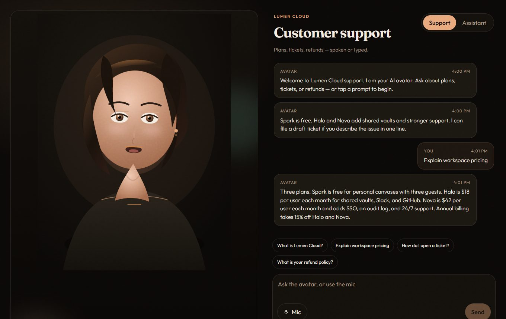
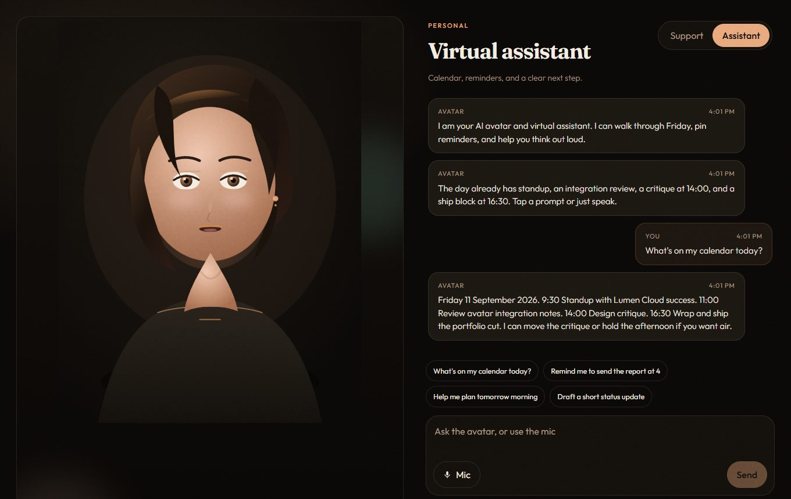

# AI Avatar Integration System

An interactive AI avatar for customer support and virtual-assistant conversations. Built as a portfolio piece for **Pettem Sai Sriya**.

The avatar is the face. The chat panel is the product. The **AvatarEngine** is the integration API.

[](https://github.com/Saisriya2003/ai-avatar-integration-system/actions/workflows/ci.yml) [](LICENSE) [](test) [](Dockerfile)

Full documentation — architecture, the AvatarEngine API, speech and lip-sync, reply engines, modes, API, UI workflow, configuration, CI: **[DOCUMENTATION.md](DOCUMENTATION.md)**.

## Screenshots

| Support mode — Lumen Cloud customer support | Assistant mode — calendar, reminders, drafts |
| --- | --- |
|  |  |

## Quick start

**Requirements:** [Node.js 18+](https://nodejs.org/) on your PATH. No API keys. Use Chrome or Edge for microphone and speech. Prefer containers? See [Run with Docker](#run-with-docker).

```bash
git clone https://github.com/Saisriya2003/ai-avatar-integration-system.git
cd ai-avatar-integration-system
```

Then run the one-command starter for your OS. It installs dependencies on first run, starts the chat API on `http://127.0.0.1:5070` and the UI on `http://localhost:5176`, and opens the browser.

| OS | Command |
| --- | --- |
| Windows (PowerShell) | `.\start.ps1` |
| macOS / Linux | `chmod +x start.sh && ./start.sh` |

If PowerShell refuses to run the script ("running scripts is disabled"), use:

```powershell
powershell -ExecutionPolicy Bypass -File .\start.ps1
```

Manual steps are under **How to run** below. CI builds the UI and smoke-tests `/api/chat` on every push.

### Troubleshooting

- **Status pill says "On-device fallback"** — the Express server is not running; chat still works from the built-in client responder. Start `npm run server`.
- **Mic button disabled** — the browser lacks `SpeechRecognition`. Use Chrome or Edge and allow the microphone.
- **Port 5070 or 5176 already in use** — set `PORT` in `.env` and update the proxy target in `vite.config.js`.

| | |
| --- | --- |
| Stack | React, Vite, SVG avatar, Web Speech API, Node.js, Express |
| Avatar API | `createAvatarController()` — emotion, visemes, listen/speak, blink, look-at |
| Replies | Local intent engine by default; OpenAI when `OPENAI_API_KEY` is set |
| Modes | Customer support (Lumen Cloud) and virtual assistant |

## What this demonstrates

- Interactive AI avatar for user engagement
- Real-time communication (typed chat + Web Speech)
- Customer support (fictional product **Lumen Cloud**) and virtual assistant modes
- A local **Avatar API**: visemes, emotion, blink, look-at, listen/speak

No paid avatar vendor is required. Ready Player Me, D-ID, or HeyGen can sit behind the same `AvatarEngine` methods later.

## Architecture

```
React (Vite)                         Express :5070
┌─────────────────────────┐          ┌─────────────────────┐
│ Avatar.jsx  (SVG face)  │          │ POST /api/chat      │
│ engine.js   (API)       │  /api    │  local intents  OR  │
│ Web Speech  (mic + TTS) │ ───────▶ │  OpenAI if keyed    │
│ localBrain.js fallback  │          │ GET  /api/health    │
└─────────────────────────┘          └─────────────────────┘
```

### AvatarEngine

`src/avatar/engine.js` exports `createAvatarController()`:

| Method | Role |
| --- | --- |
| `setEmotion(name)` | `neutral` · `smile` · `listen` · `think` · `concern` |
| `setViseme(name)` | `closed` · `small` · `mid` · `open` · `wide` |
| `setListening(bool)` | Mic ring + listen face |
| `setSpeaking(bool)` | Speaking glow |
| `speak(text)` | Web Speech synthesis + lip-sync visemes |
| `stop()` | Cancel speech |
| `blink()` / `lookAt(x, y)` | Idle life and pointer gaze |

Open the collapsed **Avatar API** drawer in the UI to inspect live state and preview emotions or visemes.

Lip-sync uses `SpeechSynthesisUtterance` boundary events when the browser fires them, with a character ticker fallback so mouths still move on Windows voices that only report word boundaries.

### Reply engines

1. **Server local** — intent matcher + templated answers in `server/brain.js` (default, offline)
2. **OpenAI** — if `OPENAI_API_KEY` is set, `/api/chat` upgrades automatically
3. **Client fallback** — `src/lib/localBrain.js` if the server is down

## How to run

Need Node 18+. From this folder:

```bash
npm install
```

**Terminal 1 — API**

```bash
npm run server
```

Listens on `http://127.0.0.1:5070`.

**Terminal 2 — UI**

```bash
npm run dev
```

Vite serves the client (port 5176) and proxies `/api` to the Express server.

Production build:

```bash
npm run build
npm run preview
```

Keep `npm run server` running so the preview proxy can reach `/api/chat`.

### Optional OpenAI

Copy `.env.example` to `.env` and set:

```
OPENAI_API_KEY=sk-...
OPENAI_MODEL=gpt-4o-mini
```

Restart the server. `GET /api/health` will report `"llm": true`. The UI still works with the key omitted.

## Windows notes

- Use two PowerShell windows (or two Cursor terminals) for client and server.
- **Chrome or Edge** is the reliable path for Web Speech: `webkitSpeechRecognition` plus `speechSynthesis`. Firefox may lack recognition; typing still works.
- Allow the microphone when the browser asks. If permission is denied, the avatar stays on text.
- If port 5070 is taken: set `PORT` in `.env` and match `vite.config.js` proxy target. Pick a port browsers allow — Chrome and Edge block 5060/5061 (SIP) with `ERR_UNSAFE_PORT`.
- `curl.exe` works in PowerShell; the `curl` alias is `Invoke-WebRequest`.

```powershell
curl.exe -s http://127.0.0.1:5070/api/health
curl.exe -s -X POST http://127.0.0.1:5070/api/chat -H "Content-Type: application/json" -d "{\"mode\":\"support\",\"messages\":[{\"role\":\"user\",\"text\":\"What is Lumen Cloud?\"}]}"
```

## Product modes

- **Support** — Lumen Cloud plans, tickets, refunds, status, integrations
- **Assistant** — seeded Friday 11 September 2026 calendar, reminders, drafts

## Swap-in path

Keep `createAvatarController()` as the façade. Replace the SVG renderer in `Avatar.jsx` or the internals of `speak()` with a vendor stream. Chat, mic, and `/api/chat` do not change.

## Run with Docker

One container: Express serves `/api/chat` and the built React UI from the same origin.

```bash
docker compose up --build
# App http://localhost:5176        API  http://localhost:5176/api/health
```

Or without compose: `docker build -t ai-avatar-integration-system . && docker run -p 5176:5070 ai-avatar-integration-system`. Put `OPENAI_API_KEY=...` in a `.env` file beside `docker-compose.yml` for OpenAI replies. Change the host port with `WEB_PORT`.

## Tests

`test/` — 17 tests with Node's built-in runner: intent routing for every suggested prompt in both modes (server engine and client fallback), whole-word key matching, emotion tagging, viseme mapping, and the **AvatarEngine controller** — subscriptions, validation, gaze clamping and pointer lock, blink pulse, `speak()` lifecycle, `stop()` not clobbering manual visemes, and reversible `destroy()`/`start()`.

```bash
npm test
```

## License

MIT — see [LICENSE](LICENSE). Lumen Cloud and its plans are fictional.